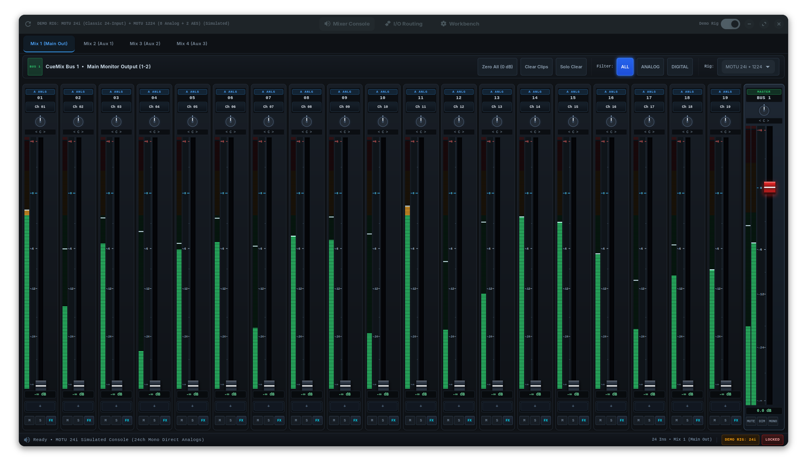

# motu-pci-424
**For PCIe please refeer to : https://github.com/devfrp/Linux-motu-pci-424/tree/branche-PCIe**
*Read this in: **English** · [Français](README.fr.md)*

🌐 **Website:** <https://samplaman.github.io/motu_pcie_424_linux/>

A from-scratch Linux ALSA driver for the **MOTU PCI-324 / PCI-424** audio card
and its AudioWire breakout interfaces (2408, 24I/O, 828, HD192, 896HD, …).

<p align="center">
  
</p>

> **Status: driver implements the reverse-engineered hardware model; awaiting
> a real card.** The PCI / IRQ / ALSA machinery is real and complete, and the
> hardware layer now encodes the model recovered from the vendor Windows driver
> (windowed card-address space, I/O-port bridge, PIO-aperture transport, real
> IRQ ack protocol — see [Reverse engineering](#reverse-engineering)). Two
> things still gate audio: the **card-reported runtime addresses** (audio
> base / IRQ ack — injectable via `motu424.audio_base=`/`ack_addr=` module
> parameters once dumped from a card) and the aperture ring base (placeholder,
> `TODO: verify`). The module loads and registers an ALSA card; streaming is
> refused until those values are known.

## Quick start

```sh
curl -fsSL https://raw.githubusercontent.com/samplaman/motu_pcie_424_linux/main/get.sh | sh
```

Installs on any distro (deps + DKMS module + tools). Details and options under
[Install](#install-any-distro).

## Layout

| Path | Role |
|------|------|
| `kernel/motu424.h` | Shared defs + the **RE'd hardware model** (single source of truth) |
| `kernel/motu424_main.c` | PCI attach/detach, resource + IRQ management, interrupt handler |
| `kernel/motu424_hw.c` | **Hardware abstraction — the only file with real register semantics** |
| `kernel/motu424_pcm.c` | ALSA PCM callbacks (playback + capture) |
| `tools/motu424-probe.c` | Userspace BAR enumerator/dumper (windowed model) for reverse engineering |
| `tools/motu424-ctl.c` | **CueMix-style management CLI** (clock/format + monitor mixer) over alsa-lib |
| `tools/motu424-gui` | **GTK4 mixing console** in the CueMix FX style (a front-end over `motu424-ctl`) |
| `tools/re/` | Static-RE helpers (`vtable-scan.py`, capstone `xref.py`) |
| `get.sh` | **`curl \| sh` bootstrap** — fetch sources + run the installer |
| `install.sh` | **Cross-distro installer** (deps + DKMS + tools) |
| `ARCHITECTURE.md` | Design notes: the 3-layer split + hardware-confinement rule |
| `CLEANROOM.md` | Clean-room & provenance statement (legal basis, RE method) |
| `docs/index.html` | Project website (GitHub Pages landing page) |
| `dkms.conf` | DKMS packaging for automatic rebuilds across kernels |

The design goal: **all uncertainty is confined to `motu424.h` + `motu424_hw.c`.**
Once the true register layout is known, only those two files change.

## Install (any distro)

One line — fetches the sources and runs the installer:

```sh
curl -fsSL https://raw.githubusercontent.com/samplaman/motu_pcie_424_linux/main/get.sh | sh
# pass installer options through:
curl -fsSL https://raw.githubusercontent.com/samplaman/motu_pcie_424_linux/main/get.sh | sh -s -- --no-dkms -y
```

Or clone and run the installer directly. It detects your package manager
(pacman/apt/dnf/yum/zypper/apk/xbps), pulls the build dependencies, installs the
module via **DKMS** (so it survives kernel upgrades) and installs the tools:

```sh
./install.sh              # deps + DKMS + tools + load  (uses sudo as needed)
./install.sh -y           # non-interactive package installs
./install.sh --no-dkms    # plain in-tree build + install instead of DKMS
./install.sh --uninstall  # remove module + tools
./install.sh -h           # all options
```

Under `curl | sh`, the installer detects the absence of a terminal and
automatically switches package installs to non-interactive mode; sudo still
prompts for your password on the terminal as usual.

## Build (manual)

Requires kernel headers for the running kernel (Arch: `linux-rt-headers` for an
RT kernel, or `linux-headers` otherwise) and `alsa-lib` for `motu424-ctl`.

```sh
make            # build module + tools
make load       # insmod kernel/motu424.ko
dmesg | tail    # look for "MOTU PCI-4xx registered as ALSA card N"
aplay -l        # the card should appear
make unload
```

### Managing the card (CueMix for Linux)

`tools/motu424-ctl` is the userspace control app — the Linux equivalent of MOTU's
CueMix FX. It auto-locates the MOTU card and manages the driver's ALSA mixer
kcontrols (clock source, sample rate, per-input trim/pad/phase, and the input×bus
monitor matrix). Control set + naming: [`docs/cuemix-control-map.md`](docs/cuemix-control-map.md).

```sh
make tools                              # builds motu424-ctl if alsa-lib is present
./tools/motu424-ctl                     # CueMix-style status overview
./tools/motu424-ctl list                # every control
./tools/motu424-ctl set 'Clock Source' Internal
./tools/motu424-ctl set 'Mix 00 Input 03 Volume' 92
```

The mixer controls are Phase 5 (card-gated); the app is written to light up
automatically as the driver registers them, and degrades cleanly when absent.

#### Graphical console

`tools/motu424-gui` is a GTK4 **CueMix FX-style mixing console** — a front-end
over `motu424-ctl`, so the tested CLI stays the single source of truth. It
rebuilds the CueMix model from the kcontrol names and renders it like the real
console: one tab per mix bus (channel strips with send fader, peak-hold meter,
rotary pan pot, mute/solo/gang, the bus master pinned on the right), a **DSP Studio**
tab (precision 7-band parametric EQ curves and hardware dynamics processor with
knee compressor & GR meter), an Inputs tab (trim, pad, phase, stereo pairs), an
Outputs tab (mono monitor strips, stereo-linkable like the inputs), a Patchbay
tab (optional, no cords by default — drawn like a real normalled bay: outputs sit at
their normals, with main outs normalled to the system's stereo program so desktop
sound reaches the monitors unconfigured, and you drag virtual cables to patch anything
else; hovering a jack tells you what it carries, "Unpatch all" pulls every cord in
one undoable step, and a global switch bypasses the bay back onto the
normals), a Clock & format tab, and a
Diagnostics tab that works even with no card and no driver loaded.

<p align="center">
  
  <br>
  <em>Mixer Console: Per-bus strips with send faders, peak-hold meters, rotary pan pots, and master monitor output</em>
</p>

<p align="center">
  
  <br>
  <em>DSP Studio: Precision 7-band parametric EQ curves and hardware dynamics processor (knee compressor & GR meter)</em>
</p>

The whole layout adapts to the converters attached to the PCI-424's AudioWire
slots: the driver names every channel per slot and bank (analog, ADAT, TDIF,
AES/EBU, main out, phones — see `docs/cuemix-control-map.md`), and the console
regroups its strips and patchbay jacks under "slot · model — bank" headers.
A 24I/O brings 24 analog I/O, a 1224 brings 8 analog I/O plus an AES/EBU pair
and main outs — that combination is exactly what `--demo` simulates, and
`--rig 24io,2408` hangs other converters (24io, 1224, 2408, hd192) off the
four AudioWire slots instead. The
console also follows the card over time: when the registered control set
changes (module load/unload, converters hot-plugged, channel counts shrinking
in the 2x/4x rate families) it rebuilds itself on the next poll, keeping the
tab you were on — flip the sample rate in `--demo` to watch the shrink live.

On top of the basics: stereo-pair and gang linking, A/B scenes, header
TALK / LISTEN talkback buttons (hold to talk momentarily, a quick click
latches), per-bus mix copy/reset, JSON mix snapshots
(Ctrl+S / Ctrl+O), Ctrl+Z undo of mix-wide
operations, editable channel names, and a "Shortcuts & tips" dialog on F1.
Control writes are coalesced through a worker thread and the hardware is
re-polled in the background, so the console follows changes made elsewhere
(alsamixer, a second instance) without fighting the control you are touching.

```sh
./install.sh --gui        # installs the launcher + its runtime deps
motu424-gui               # or launch from your app menu ("MOTU CueMix")
motu424-gui --demo        # full console against a synthetic 24I/O + 1224 rig
```

Needs `python-gobject` + `gtk4` (added automatically by `--gui`). The mixer
kcontrols are Phase 5 (card-gated): with no MOTU card the console has nothing
to populate — preview it with `--demo`; on real hardware it fills in
automatically once the driver registers its controls.

## Reverse engineering

The driver already implements the RE'd hardware model; what a real card must
supply are the **card-reported runtime addresses** (audio base, IRQ ack, the two
aperture bases) and a few values still marked `TODO: verify`. Bring-up flow:

1. **Identify the card.** `lspci -nn | grep -i 137a` (0x137A = Mark of the Unicorn).
2. **Enumerate + classify the BARs** with the driver *unbound*:
   ```sh
   sudo ./tools/motu424-probe                       # tags window A / B / port
   sudo ./tools/motu424-probe 0000:01:00.0 0xc0000 0x400   # window-B dump @off,len
   ```
   It reads the known window-B bank ctrl/status regs and takes a targeted dump
   for **diffing** idle vs. streaming (under the vendor OS) to locate the audio
   base / ack / aperture card addresses.
3. **Inject those addresses** and load the driver:
   ```sh
   sudo insmod kernel/motu424.ko \
       audio_base=0x… ack_addr=0x… play_aperture=0x… cap_aperture=0x…
   ```
   Without them the card registers but streaming is refused (`-ENXIO`) — this is
   deliberate, so the driver never pokes unknown addresses.
4. **Trace the event format** (channel count per sample-rate family, 24-bit
   packing, endianness) and the exact `base+0x64` rate dword.
5. Fold confirmed values into `motu424.h` / `motu424_hw.c` (drop the params).

Most of the protocol was **already** recovered statically from the vendor driver
(no card needed) — the confirmed facts below; the remaining gaps are what steps
1–5 close on real hardware.

### Findings from vendor driver RE (static, no card)

Established by disassembling the vendor Windows driver `MOTUAW.sys`, using
`objdump`, `tools/re/vtable-scan.py` (resolves C++ vtable slots) and
`tools/re/xref.py` (capstone-based cross-references — callers, function bodies,
virtual-dispatch sites). These **supersede the hypothesised register map** in
`motu424.h`:

- **Two MMIO windows, not a small register file.** The card exposes a windowed
  ~24-bit "card address" space. A 32-bit address is routed by
  `(addr & 0xff800000) == 0x01800000`: if true → window A `(addr & 0x7fffff)`
  (8 MB), else → window B `(addr & 0x3fffff)` (4 MB). Per-bank ctrl/status regs
  at `0xC0024` / `0x100024` (bank+`0x24`, stride `0x40000`), reachable via
  window A at `0x18C0000` / `0x1900000`. (`0xAC44` is **not** an address — it is
  44100 decimal; all six rates appear as Hz constants `0xAC44`..`0x2EE00` in the
  divisor math.)
- **A small I/O-port BAR** (`READ/WRITE_PORT_ULONG`) holds bridge/GPIO control:
  read `+0x0` (bit 1 = IRQ pending), write `+0x0`←4 (IRQ/stream enable), write
  `+0x4`←1 (strobe/commit). A PLX-style local-bus bridge in front of the FPGA.
- **IRQ path — confirmed** (ISR = vtable `0x30cc0` slot `0x28` = `0x2bae0`):
  pending = port BAR `+0x0` bit 1; **ack = write `0x10`** to the card address in
  device-ext `+0x88`; "period elapsed" fires when a per-IRQ accumulator crosses
  `0x800`, then a DPC is queued.
- **Audio register block — confirmed** (base = a card address in device-ext
  `+0x98`): `base+0x54`←1 stream enable, `base+0x60` period increment
  (`0x10 << 2*family`), `base+0x64` rate/clock parameter, `base+0x128/12c/130`
  position counters (read then zeroed each period).
- **Audio transport is PIO into a card aperture, not host bus-master DMA.** The
  push helper (`fn 0x29420`) copies host buffers into window B via
  `WRITE_REGISTER_BUFFER_ULONG` (a `'MOTU'`-tagged 64 KB bounce buffer) and
  tracks a hardware `dmaPoint` + software `readHead`/`writeHead`/`len`.
- **FPGA firmware.** Two architectures: the classic PCI-324/424 uses an Altera
  passive-serial FPGA (`altera424b.rbf`, **not** present in the 4.0.6 vendor
  installer — likely self-configured from onboard flash); the PCIe **HD Express**
  uses an ARM SoC + Xilinx Virtex, shipped as `HDExpress_FullImageRun.bin` (a
  24-byte-header container, checksum-verified). Verdict of the full RE
  ([`docs/fpga-upload.md`](docs/fpga-upload.md)): the classic card needs **no
  host firmware upload** (no `request_firmware()`); only the PCIe HD Express
  variant takes a host image.
- **CueMix control set** decoded from the shipped `CueMixFX-PCI-424.touchosc`
  (MOTU's CueMix OSC API): an input×mix-bus monitor matrix + per-input analog
  conditioning + clock/format. Drives `tools/motu424-ctl` — see
  [`docs/cuemix-control-map.md`](docs/cuemix-control-map.md).

Detailed, evidence-tagged write-ups live in `docs/`:
[`register-map.md`](docs/register-map.md), [`transport.md`](docs/transport.md),
[`fpga-upload.md`](docs/fpga-upload.md),
[`cuemix-control-map.md`](docs/cuemix-control-map.md),
[`vendor-driver-map.md`](docs/vendor-driver-map.md).

Still open (need the card, or deeper `rz-ghidra` work on the two embedded
sub-objects): the clock-source select register/bits and the `base+0x64`
parameter encoding, the runtime numeric values of the audio base / ack
addresses. The classic-card FPGA upload handshake is settled — the RE verdict
([`docs/fpga-upload.md`](docs/fpga-upload.md)) is that it self-configures from
onboard flash and needs no host upload.

The full phased roadmap from here to a 100% working driver lives in
[`docs/REVERSE_ENGINEERING_PLAN.md`](docs/REVERSE_ENGINEERING_PLAN.md).

## License

GPL-2.0-or-later. Kernel modules linking GPL-only ALSA symbols must be GPL.
